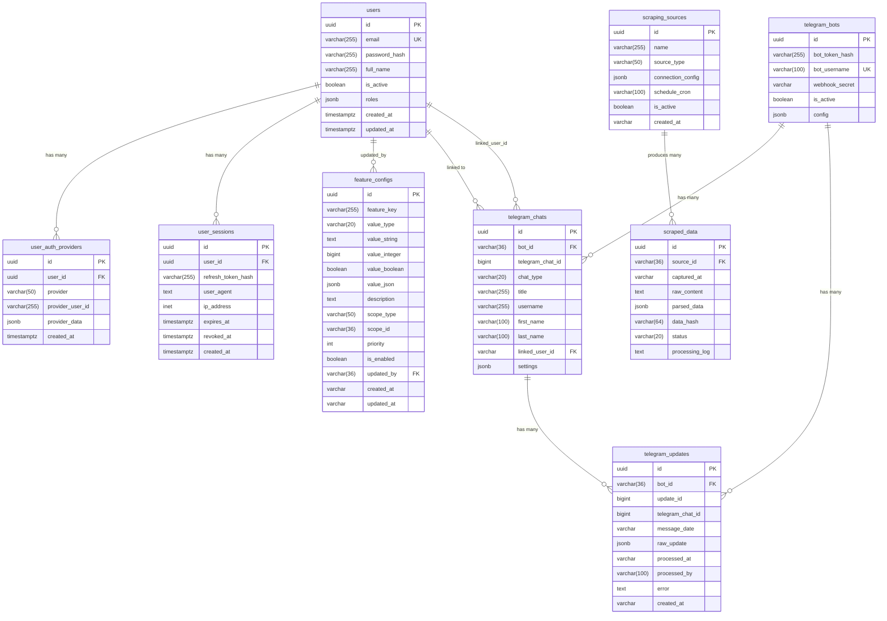
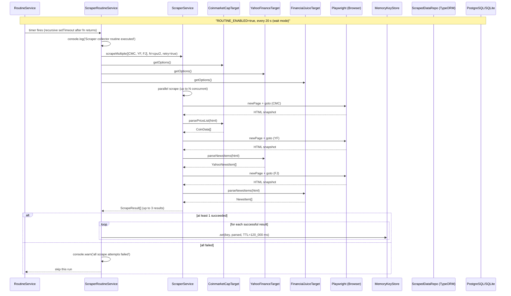
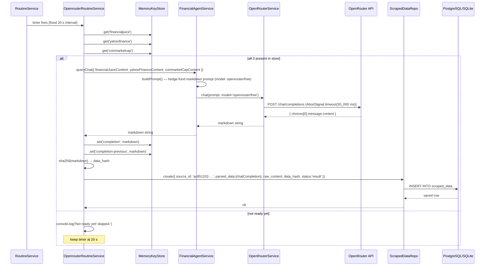
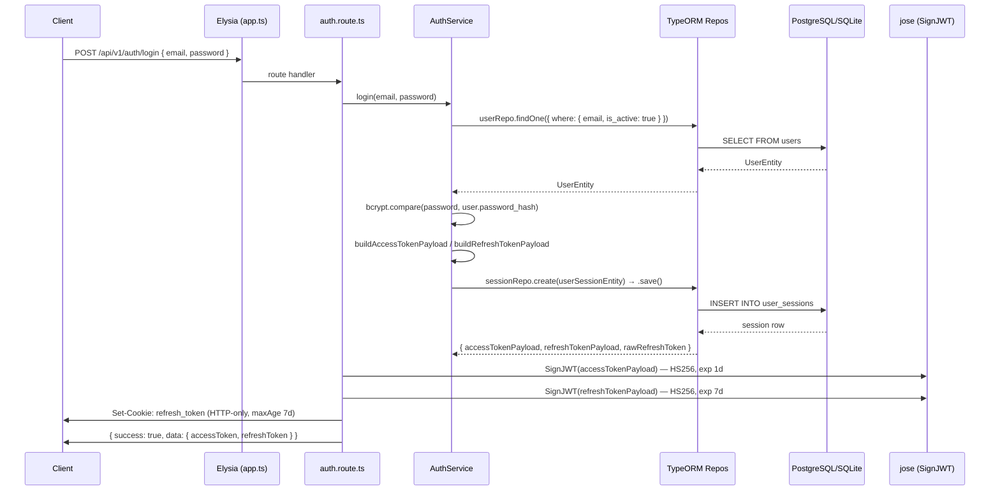
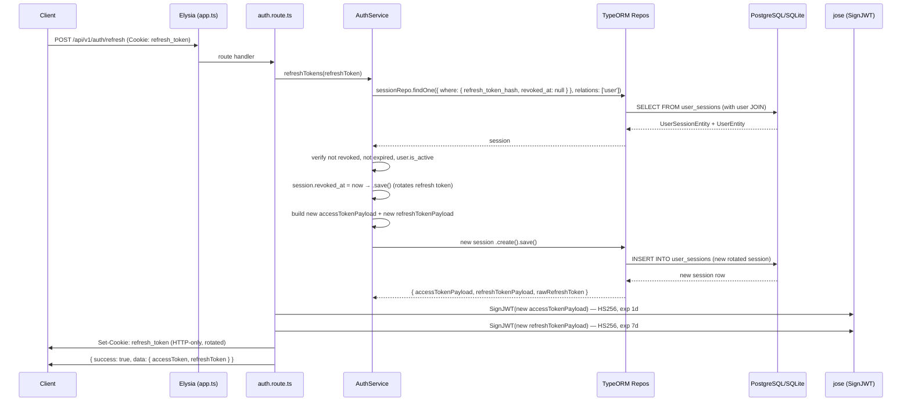
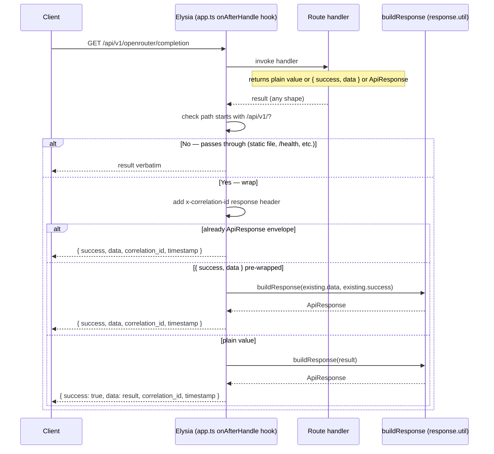
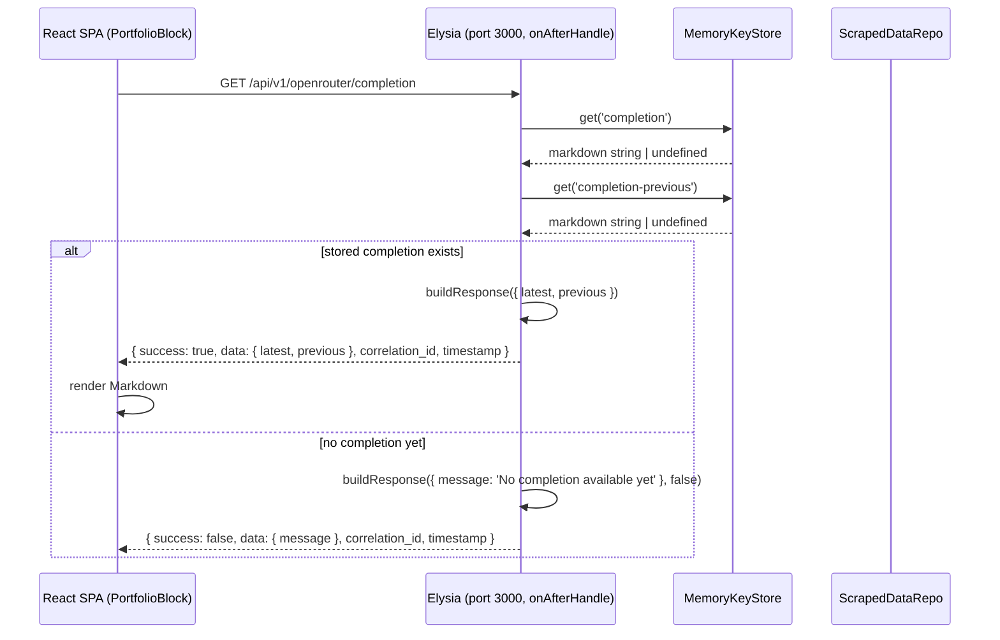

# Apollo — System Design

## Table of Contents

1. [Database Schema](#database-schema)
2. [Sequence Diagrams](#sequence-diagrams)

---

## Database Schema

**Column name conventions above are PostgreSQL-native** (`timestamptz`, `inet`, `jsonb`, `uuid`). SQLite entities map these to compatible types (`varchar` for all UUID/timestamp/inet columns; `json` for jsonb; `text` for large strings).

Unique / composite constraints carried by entities but not visible in the ERD field list:
- `user_auth_providers(provider, provider_user_id)` — `/  UNIQUE`
- `telegram_chats(bot_id, telegram_chat_id)` — `/  UNIQUE`
- `telegram_updates(bot_id, update_id)` — `/  UNIQUE`
- `scraped_data(source_id, data_hash)` — `` @Unique`` — avoids perfect duplicates
- `feature_configs(feature_key, scope_type, scope_id)` — `/  UNIQUE`

Indexes registered via `@Index` decorators in entities (forward-engineering already present in `db_init.sqllite.sql`):
- `idx_users_email_active(users:email, is_active)` · `idx_scraped_captured(scraped_data:captured_at)` · `idx_scraped_status(scraped_data:status)` · `idx_scraping_source_type(scraping_sources:source_type)` · `idx_scraping_source_active(scraping_sources:is_active)` · `idx_session_token_hash(user_sessions:refresh_token_hash)` · `idx_session_user(user_sessions:user_id)`

Additional indexes in SQLite bootstrap file (not yet in entity decorators): `idx_users_email`, `idx_users_created_at`, `idx_users_active`, `idx_user_auth_user`, `idx_user_auth_provider`, `idx_user_sessions_user`, `idx_user_sessions_expires`, `idx_telegram_bots_username`, `idx_telegram_chats_bot`, `idx_telegram_chats_linked_user`, `idx_telegram_updates_bot`, `idx_telegram_updates_chat`, `idx_telegram_updates_date`, `idx_scraping_sources_created`.

---

## Sequence Diagrams

### 1. Scraper Routine — Full Pipeline (Every 20 s)

### 2. OpenRouter Routine — AI Synthesis (Every 20 s)

### 3. Auth — Login Flow

### 4. Auth — Refresh Token Flow

### 5. Response Envelope — Universal /api/v1/* Wrapping

### 6. Frontend — Fetching Completion

### 7. Telegram Webhook

---

## Key Notes

### Routines

Three background routines run after the server starts listening on port 3000. All are controlled by `ROUTINE_ENABLED` (default `false`) and use `ROUTINE_EXECUTION_MODE` (default `wait` — recursive `setTimeout`, next run only after current finishes completes).

| Routine | Interval | Purpose |
|---|---|---|
| `scraper-routine` | 20 s | Scrape CMC, YahooFinance, FinancialJuice → `MemoryKeyStore` |
| `openrouter-routine` | 20 s (fixed) | Read store → call OpenRouter → persist to `scraped_data` |
| `supabase-routine` | 300 s | Placeholder for periodic Supabase work |

`RoutineService.startRoutine()` returns `0` in `'wait'` mode; real Bun timer handles are stored internally.

### MemoryKeyStore as Pipeline State

`MemoryKeyStore` (from `src/lib/memory-key-store.ts`) is the **only in-memory shared state** — it bridges the gap between the two independent routines without Redis. The scraper writes; the OpenRouter routine reads. No locking or concurrency control is needed because the `wait` execution mode serialises execution. Supports TTL, LRU eviction, and `getOrSet` with async factory and pending-promise deduplication.

### Scraper concurrency

`scraper-routine.service.ts` uses `Math.max(1, Math.floor(os.cpus().length / 2))` as the concurrent scrape semaphore — parallel across available CPU cores rather than a fixed-1 sequential limit.

### OpenRouter dual-layer

- `OpenRouterService` (`src/lib/services/openrouter.service.ts`) — plain class; `createChatCompletion` / `listModels` / `chat` with in-memory 60 s TTL cache; default model `google/gemini-2.0-flash-exp:free`, default timeout `30_000 ms`.
- `OpenRouterFacade` (`src/plugins/openrouterPlugin.ts`) — Elysia plugin; same endpoints, same default model, different timeout default (`30_000 ms`). Decorated into context as `{ createChatCompletion, listModels, chat }`.
- `FinancialAgentService` calls `openRouterService.chat()` directly (not the facade), using model `openrouter/free` and its own `Promise.race` with a `300_000 ms` deadline.

### Auth guard

`authGuard` (`src/middleware/auth.guard.ts`) is a derive-based middleware that reads the `Authorization: Bearer <token>` header, verifies it with `jose/jwtVerify`, and attaches the decoded payload to `context.authPayload`. Protected routes check `authPayload?.sub` and return 401 when missing.

### CORS Origins

`http://localhost:5173`, `http://localhost:3001`, `http://localhost:3000` — aligns with Vite dev server (5173) and the Elysia server itself (3000).

### Response Envelope

A single `onAfterHandle` hook in `src/app.ts` enforces the universal envelope `{ success: boolean, data: T, correlation_id: string, timestamp: string }` on all `/api/v1/*` routes. Health checks (`/health`) and SPA static file responses (`file()` responses) are exempt. Handlers return plain values — the hook handles wrapping. See `src/lib/response.util.ts`.

### Type augmentation

`src/types/apollo.d.ts` augments `elysia.Context` to reflect every key injected by `.decorate()` in `src/app.ts` and every key declared in plugin context interfaces, eliminating `any` casts in route handlers.

### Database auto-initialisation

`src/lib/db-init.ts` runs eagerly at module scope before `AppDataSource` is constructed.

**Detection logic**

| Condition | Database used |
|---|---|
| `DATABASE_URL` env var present and non-empty | **PostgreSQL** (whatever the DSN points to) |
| `SUPABASE_URL` env var present (DATABASE_URL absent) | **PostgreSQL** — Supabase-managed |
| Neither set | **SQLite** — forced automatically |

**SQLite force-init steps** (runs when no Postgres config is detected)

1. `.env` is created/updated: `DATABASE_URL=sqlite` — picked up immediately by `Bun.env`.
2. `JWT_SECRET` is auto-generated (`crypto.randomUUID()`) and written to `.env` + `Bun.env` only when absent, preventing `app.ts`'s `@elysiajs/jwt` plugin from crashing with "Secret can't be empty".
3. `data/` directory is purged (no stale WAL/shm files or schema mismatches).
4. `data/` directory is recreated.
5. A throwaway TypeORM DataSource with `synchronize: true` is opened against `data/apollo.sqlite` — auto-creates every table declared by the entity classes.
6. `.workspace/db_init.sqllite.sql` is replayed using the native `sqlite3` driver — adds indexes, `UNIQUE` constraints, `DEFAULT` expressions, and handles raw PRAGMA / DEFAULT clauses that TypeORM's query builder cannot parse.
7. The bootstrap DataSource is destroyed. `src/lib/db.ts` then builds the `AppDataSource` that the rest of the codebase uses — for SQLite it also sets `synchronize: true` (safe because the schema was seeded cleanly first).

The whole decision is transparent to `src/app.ts` and every repository — no conditional imports, no feature flags.
