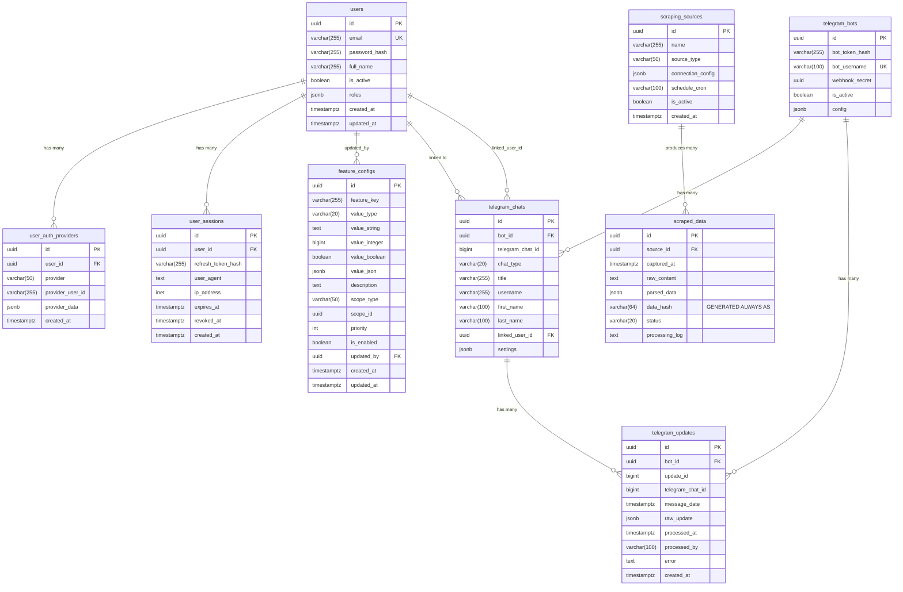
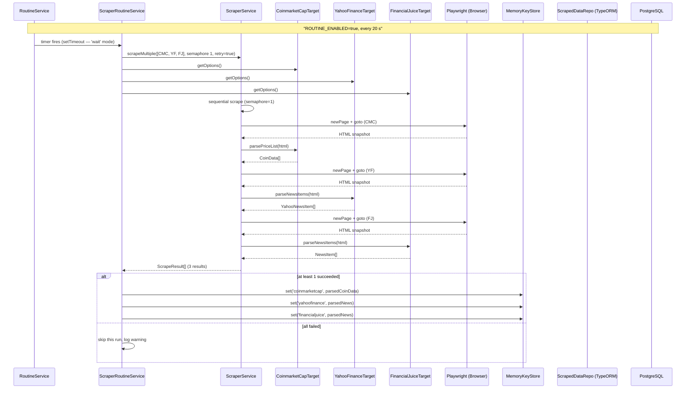
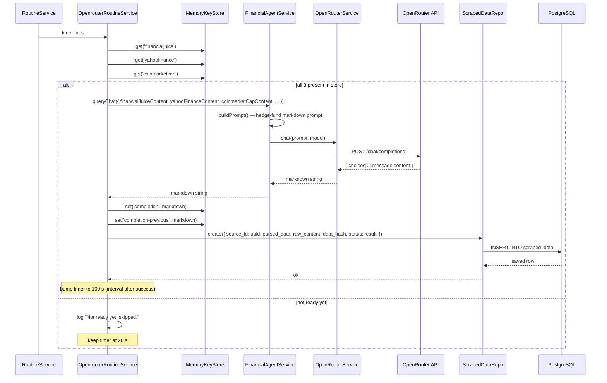
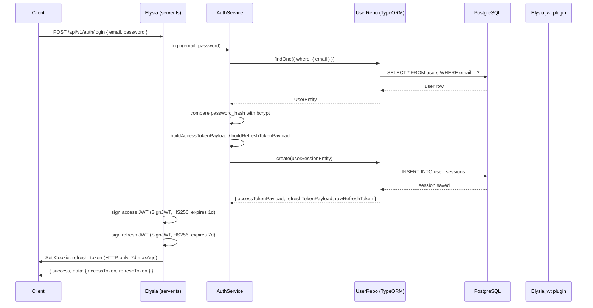
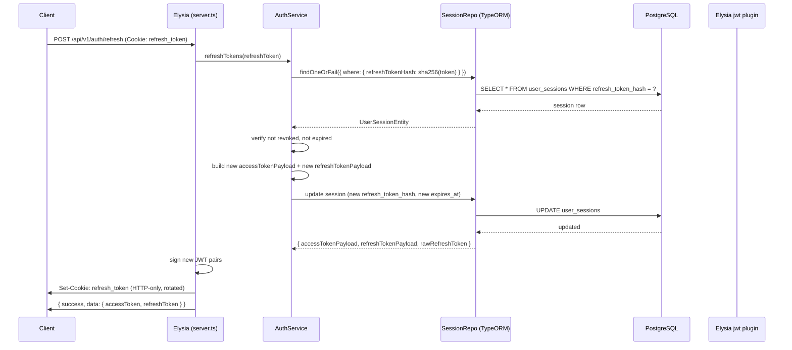
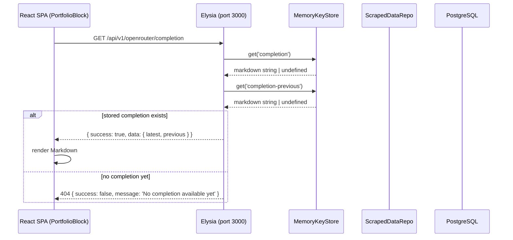
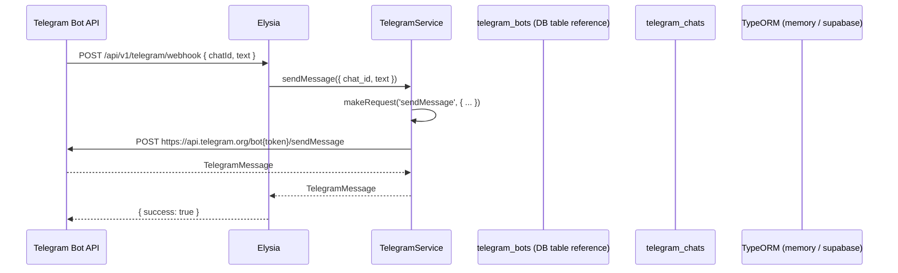

# Apollo — System Design

## Table of Contents

1. [Database Schema](#database-schema)
2. [Sequence Diagrams](#sequence-diagrams)

---

## Database Schema

---

## Sequence Diagrams

### 1. Scraper Routine — Full Pipeline (Every 20 s)

### 2. OpenRouter Routine — AI Synthesis & Persistence (Every 20–100 s)

### 3. Auth — Login Flow

### 4. Auth — Refresh Token Flow

### 5. Frontend — Fetching Completion

### 6. Telegram Webhook

---

## Key Notes

### Routines

Three background routines run after the server starts listening on port 3000. All are controlled by `ROUTINE_ENABLED` (default `false`) and use `ROUTINE_EXECUTION_MODE` (default `wait` — recursive `setTimeout`, next run only after current finishes).

| Routine | Interval | Purpose |
|---|---|---|
| `scraper-routine` | 20 s | Scrape CMC, YahooFinance, FinancialJuice → `MemoryKeyStore` |
| `openrouter-routine` | 20 s → 100 s after success | Read store → call OpenRouter → persist to `scraped_data` |
| `supabase-routine` | 300 s | Placeholder for periodic Supabase work |

### MemoryKeyStore as Pipeline State

`MemoryKeyStore` is the **only in-memory shared state** — it bridges the gap between the two independent routines without Redis. The scraper writes; the OpenRouter routine reads. No locking or concurrency control is needed because the `wait` execution mode serialises execution.

### CORS Origins

`http://localhost:5173`, `http://localhost:3001`, `http://localhost:3000` — aligns with Vite dev server (5173) and the Elysia server itself (3000).
