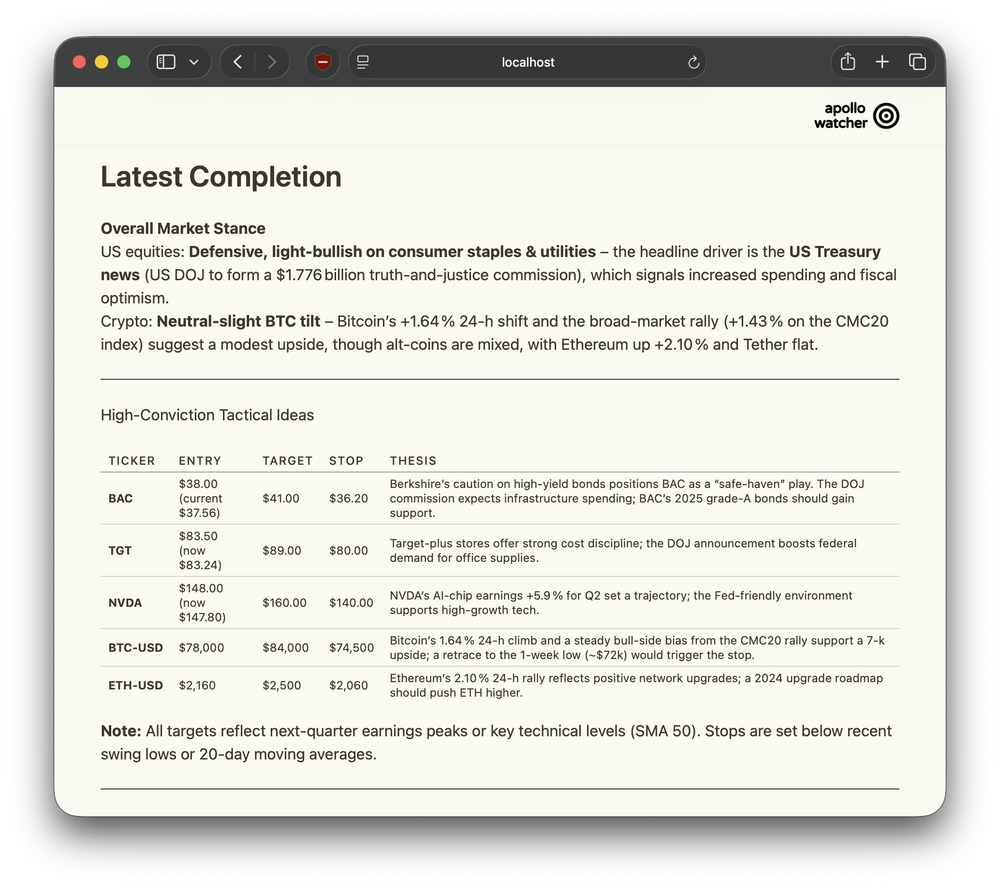

<div align="center">
  

  <p align="center">
    Simple scraper - economics news watcher
    <br />
    <a href="https://github.com/GabrielTenma/apollo-bun/releases">Release</a>
    ·
    <a href="https://github.com/GabrielTenma/apollo-bun/issues">Report Bug</a>
    ·
    <a href="https://github.com/GabrielTenma/apollo-bun/issues">Request Feature</a>
  </p>
  <hr>
</div>


## Overview

Just a simple project focusing on scrape data related with economics for who need answer to take decision into market, processed with multiple sources data and openrouter LLM for describe the market tension, I called this `apollo`.

## How it works

Basically this app just collect data from trusted platform who updates related economic topic, wrap it up become one data and analyze with openrouter LLM autoselect `free` model, then send the result to social chat platform `telegram` for now.

Errors and structured events are logged via [evlog](https://evlog.dev) — one wide event per failure with full context, no scattered lines.

For the future plan focusing integrate to stackyrd pkg which `diameter-tscd` project, frontend and manageable web-content.

## Getting Started

### Prerequisites

- Bun (latest)
- PostgreSQL database / Supabase
- [OpenRouter](https://openrouter.ai/) API key
- Telegram bot token (from [@BotFather](https://t.me/BotFather))

### Installation

```bash
# Clone the repository
git clone https://github.com/GabrielTenma/apollo-bun.git
cd apollo-bun

# Install dependencies
bun install

# Configure environment variables
cp .env.example .env
# Edit .env and fill in your credentials
```

### Running

```bash
# Development — Vite frontend + Elysia backend in separate terminals
bun run dev              # Terminal 1: Elysia backend on :3000
bun run web:dev          # Terminal 2: Vite frontend on :3001

# Build frontend + start production server (serves frontend from :3000)
bun run web:build        # Build React app → dist/web/
bun run start            # Start Elysia server (serves API + frontend)
```

The Elysia server serves the React frontend from `http://localhost:3000/` using Elysia's native `file()` helper. API routes are prefixed under `/api/v1/`, `/telegram/`, etc. CORS allows `localhost:5173`, `localhost:3001`, and `localhost:3000`.


## Docker

The image uses a multi-stage build based on `oven/bun:1` (Debian-based).

**Critical prerequisite** — run this on the host first:

```bash
bun run web:build
```

Then build and run:

```bash
docker build -t apollo .
docker run -p 3000:3000 --env-file .env apollo
```

- The React frontend must be pre-built on the host (the Dockerfile does **not** run `bun run web:build`).
- All configuration (`OPENROUTER_API_KEY`, `DATABASE_URL`, etc.) is supplied only at runtime via `--env-file` or `-e`. No `.env` file exists inside the image.
- If `DATABASE_URL` is provided, `db_init.sql` is executed automatically on container start.
- Pre-built frontend is served from `/` by Elysia.
- Built-in `HEALTHCHECK` on `GET /health`.
- Exposed port: **3000**.


## Preview


For architecture details, see [DESIGN.md](DESIGN.md).

## License
Use Apache 2. See `LICENSE` for deal your free time.